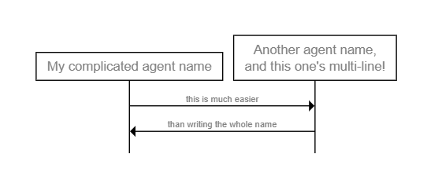

# **WebSequence**

WebSequence is part of the Code2Diagram tool, designed for creating sequence diagrams using a Domain-Specific Language (DSL). These diagrams illustrate the interactions between participants over time, making it easier to visualize complex processes, protocols, and workflows.

## **Benefits of WebSequence**

- **Simplicity**: WebSequence uses a straightforward, text-based DSL, making it accessible even to those without extensive graphical design skills.
- **Cross-Platform**: The tool can run in both Node.js environments and browsers, providing flexibility in usage.
- **Ease of Integration**: It can be easily integrated into web projects, documentation systems, and other software tools.
- **Customization**: Users can customize diagrams to match their specific needs, adjusting elements like colors, fonts, and participant roles.
- **Exportability**: Diagrams created with WebSequence can be exported in various formats such as SVG, making them easy to share and embed in different platforms.

## **DSL Basics**

Comments begin with a # and end at the next newline:
```
# This is a comment
```
Meta data can be provided with particular keywords:

```
title "My title here"

```
Quoting strings is usually optional, for example these are the same:

```
title "My title here"
title My title here
title "My title" here
title "My" "title" "here"
```

This is an websequence diagram for all the above code:


Each non-metadata line represents a step in the sequence, in order.

```
# Draw an arrow from agent "Foo Bar" to agent "Zig Zag" with a label:
# (implicitly creates the agents if they do not already exist)

Foo Bar -> Zig Zag: Do a thing

# With quotes, this is the same as:

"Foo Bar" -> "Zig Zag": "Do a thing"

```

This is an websequence diagram for the above code:


Blocks surround steps, and can nest:
```
if something
  Foo -> Bar
else if something else
  Foo -> Baz
  if more stuff
    Baz -> Zig
  end
end

```
This is an websequence diagram for the above code:


## **How It Works**

WebSequence operates by interpreting text-based descriptions of sequence diagrams written in its DSL. Users define participants and their interactions using this language, and WebSequence renders these descriptions into visual diagrams.

### **Key Features and Syntax**

#### **Participants**

Participants are the entities involved in the interaction, such as users, systems, or components.

```text
Alice -> Bob: Hello Bob, how are you?
Bob -> Alice: I'm good, thanks!

```


This is an websequence diagram for the above code:


#### **Messages**
Messages represent interactions between participants, indicated by arrows (`->`).

```
User -> Server: Request
Server -> User: Response
```
This is an websequence diagram for the above code:


#### **Notes**
Notes provide additional context or explanations within the diagram.

```
note right of User: User initiates the request

```
This is an websequence diagram for the above code:


#### **Titles and Labels**
Diagrams can have titles for better clarity.

```
title Authentication Process

```
This is an websequence diagram for the above code:


#### **Customization**
Various attributes can be adjusted to change the appearance and style of the diagrams.

## **Examples** 

Here's an example description using WebSequence:

**Simple Usage**

```
title Labyrinth
Bowie -> Goblin: You remind me of the babe
Goblin -> Bowie: What babe?
Bowie -> Goblin: The babe with the power
Goblin -> Bowie: What power?
note right of Bowie, Goblin: Most people get muddled here!
Bowie -> Goblin: "The power of voodoo"
Goblin -> Bowie: "Who-do?"
Bowie -> Goblin: You do!
Goblin -> Bowie: Do what?
Bowie -> Goblin: Remind me of the babe!

Bowie -> Audience: Sings

```
This is an websequence diagram for the above code:


**Connection Types**

```
title Connection Types

begin Foo, Bar, Baz

Foo -> Bar: Simple arrow
Bar --> Baz: Dashed arrow
Foo <- Bar: Reversed arrow
Bar <-- Baz: Reversed & dashed
Foo <-> Bar: Double arrow
Bar <--> Baz: Double dashed arrow

# An arrow with no label:
Foo -> Bar

Bar ->> Baz: Different arrow
Foo <<--> Bar: Mix of arrows

Bar -> Bar: Bar talks to itself

Foo -> +Bar: Foo asks Bar
-Bar --> Foo: and Bar replies

Bar -x Baz: Lost message

# Arrows leaving on the left and right of the diagram
[ -> Foo: From the left
[ <- Foo: To the left
Foo -> ]: To the right
Foo <- ]: From the right
[ ~> ]: Wavy left to right!
# (etc.)

```
This is an websequence diagram for the above code:


**Dividers**

```
title Dividers

begin Foo, Bar, Baz

Foo -> +Bar

divider

Bar -> +Baz

divider delay: This takes a while

-Baz --> Bar

divider tear with height 20: Lots of stuff happens

-Bar --> Foo
```
This is an websequence diagram for the above code:


**Notes & State**

```
title Note Placements

begin Foo, Bar

note over Foo: Foo says something
note left of Foo: Stuff
note right of Bar: More stuff
note over Foo, Bar: "Foo and Bar
on multiple lines"
note between Foo, Bar: Link

# in long diagrams, we can add reminders of which agent is which:
relabel

text right: "Comments\nOver here!"

state over Foo: Foo is ponderous

```
This is an websequence diagram for the above code:


**Logic**

```
title At the Bank

begin Person, ATM, Bank
Person -> ATM: Request money
ATM -> Bank: Check funds
if fraud detected
  Bank -> Police: "Get 'em!"
  Police -> Person: "You're nicked"
  end Police
else if sufficient funds
  ATM -> Bank: Withdraw funds
  repeat until "all requested money
                has been handed over"
    ATM -> Person: Dispense note
  end
else
  ATM -> Person: Error
end

```

This is an websequence diagram for the above code:


**Label Templates**

```
autolabel "[<inc>] <label>"

begin "Underpants\nGnomes" as A
A <- ]: Collect underpants
A <-> ]: ???
A <- ]: Profit!

```

This is an websequence diagram for the above code:


**Multiline Text**

```
title "My Multiline
Title"

begin Foo, Bar

note over Foo: "Also possible\nwith escapes"

Foo -> Bar: "Lines of text\non this arrow"

if "Even multiline\ninside conditions like this"
  Foo -> "Multiline\nagent"
end

state over Foo: "Newlines here,
too!"

```
This is an websequence diagram for the above code:


**Themes**

```

theme sketch

title Mockup

A thing -> +Another thing: Something happens
-Another thing --> A thing: With some response
note right of Another thing: Find out what happens here
end Another thing

```
This is an websequence diagram for the above code:


**Short-Lived Agents**

```
title "Baz doesn't live long"

note over Foo, Bar: Using begin / end

begin Baz
Bar -> Baz
Baz -> Foo
end Baz

note over Foo, Bar: Using * / !

# * and ! cause agents to be
# created and destroyed inline
Bar -> *Baz: make Baz
Foo <- !Baz: end Baz

# Foo and Bar end with black bars
terminators bar
# (options are: box, bar, cross, fade, none)

```
This is an websequence diagram for the above code:


**Agent Aliases**

```

define My complicated agent name as A
define "Another agent name,
and this one's multi-line!" as B

A -> B: this is much easier
A <- B: than writing the whole name

```

This is an websequence diagram for the above code:




**Markdown**

```
define "Name with
**bold** and _italic_" as A
define "Also `code`
and ~strikeout~" as B

A -> B: "_**basic markdown
is supported!**_"

```

This is an websequence diagram for the above code:


**Alternative Agent Ordering**

```
define Baz, Foo

Foo -> Bar
Bar -> Baz

```

This is an websequence diagram for the above code:


**Agent Types**

```
begin User, Application, PostgreSQL

User -> +Application
Application -> +PostgreSQL
-PostgreSQL --> Application
-Application --> User

User is a person
PostgreSQL is a database

```

This is an websequence diagram for the above code:


**Asynchronous Communication**

```
begin Initiator as I, Receiver as R

# the '...id' syntax allows connections
# to span multiple lines

I -> ...fin1
...fin1 -> R: FIN

# they can even inter-mix!
R -> ...ack1
R -> ...fin2
...ack1 -> I: ACK
...fin2 -> I: FIN

!I -> ...ack2
...ack2 -> !R: ACK

```

This is an websequence diagram for the above code:


**Simultaneous Actions**

```

begin A, B, C, D
A -> C

# Define a marker which can be returned to later

some primary process:
A -> B
B -> A
A -> B
B -> A

# Return to the defined marker
# (should be interpreted as no-higher-then the marker; may be
# pushed down to keep relative action ordering consistent)

simultaneously with some primary process:
C -> D
D -> C
end D
C -> A

# The marker name is optional; using "simultaneously:" with no
# marker will jump to the top of the entire sequence.

```

This is an websequence diagram for the above code:


#### Practical Uses

WebSequence is particularly useful in various scenarios such as:


- **Software Development:** Documenting system interactions, API calls, and workflows.
- **Project Management:** Visualizing process flows and task dependencies.
- **Education and Training:** Teaching complex interactions in an easily digestible format.
- **Business Analysis:** Mapping out business processes and customer journeys.
